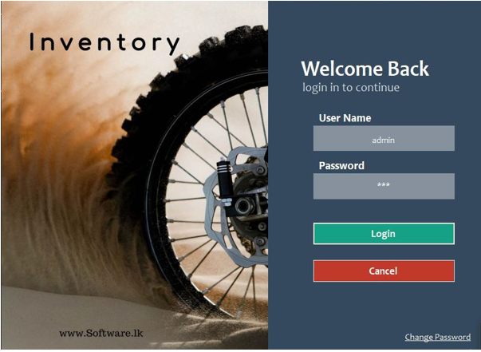
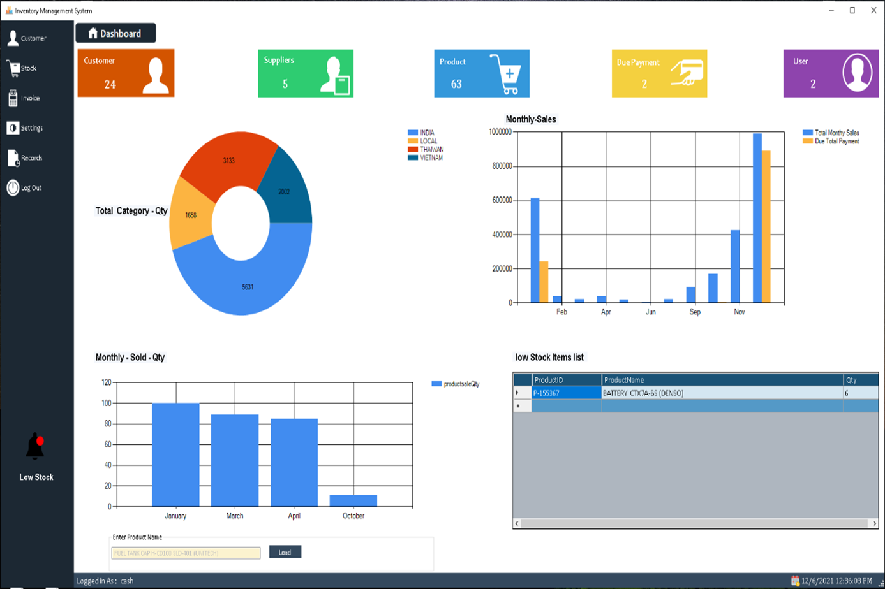
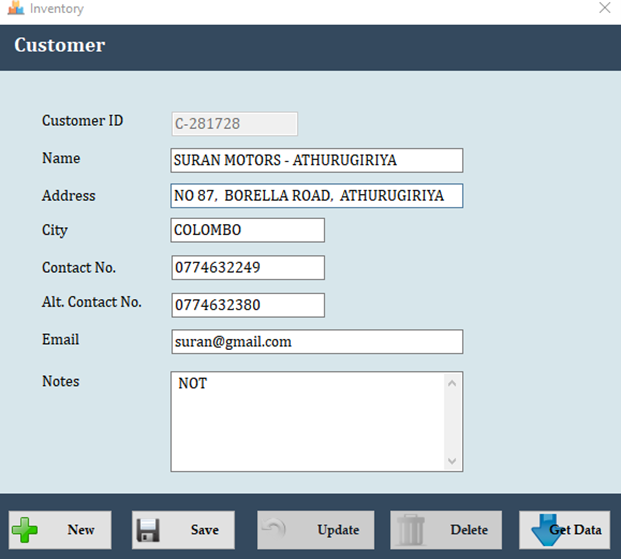
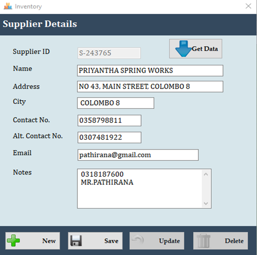
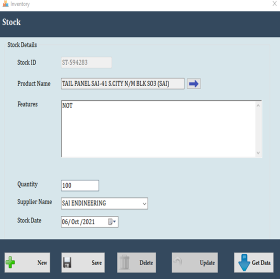
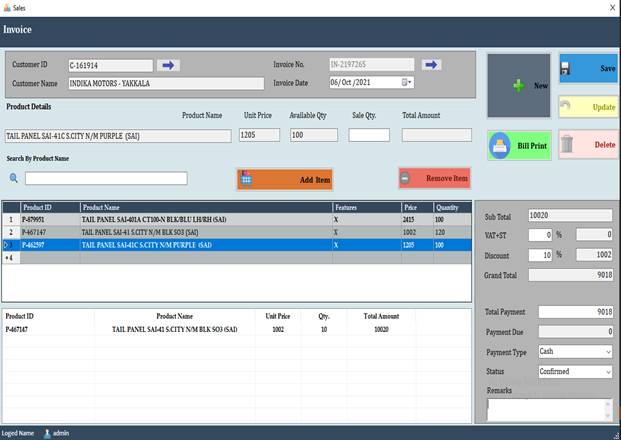
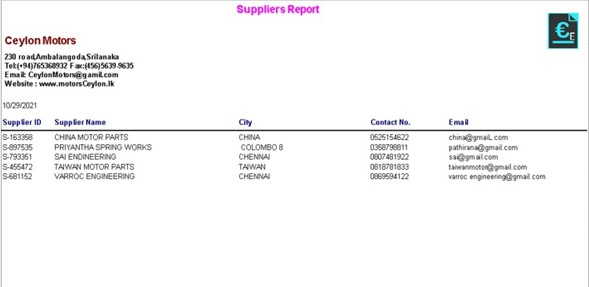

# 🛒 Inventory Management & Point of Sale (POS) System

A desktop-based Inventory Management and Point of Sale (POS) System developed using **C# Windows Forms** and **Microsoft SQL Server**. The system helps businesses manage customers, suppliers, inventory, sales, invoicing, and reports through an easy-to-use graphical interface.

---

# 📖 Overview

This application was built to simplify daily business operations by providing a centralized system for managing inventory and sales. It allows users to maintain customer and supplier information, monitor stock levels, generate invoices, and produce reports.

---

# ✨ Features

## 👥 Customer Management
- Add new customers
- Edit customer details
- Delete customer records
- Search customers
- Store addresses, contact numbers, email, and notes

## 🚚 Supplier Management
- Add suppliers
- Update supplier information
- Delete suppliers
- Search supplier records
- Store supplier contact information

## 📦 Inventory Management
- Add products to inventory
- Update stock quantities
- Delete stock records
- Manage product descriptions
- Assign suppliers to products
- Track stock dates

## 💰 Point of Sale (POS)
- Create sales invoices
- Select customers
- Search products
- Add multiple products to invoices
- Automatic subtotal calculation
- VAT calculation
- Discount support
- Grand total calculation
- Payment handling
- Invoice confirmation
- Print invoices

## 📊 Reporting
- Supplier Report
- Customer Report
- Sales Report
- Inventory Report
- Printable reports

---

# 🖼️ Screenshots

## Login 



---

## Dashboard



---

## Customer Management



---

## Supplier Management



---

## Stock Management



---

## Invoice 



---

## Reports



---

# 🛠️ Technologies Used

- C#
- Windows Forms (.NET Framework)
- Microsoft SQL Server
- ADO.NET
- Crystal Reports / Report Viewer
- Visual Studio

---

# 🗄️ Database

Database: **Microsoft SQL Server**

Main Tables:

- Customers
- Suppliers
- Products
- Stock
- Sales
- SalesDetails
- Invoice
- Users

---

# 📂 Project Structure

```
Inventory-POS-System/
│
├── Database/
│   └── InventoryDB.sql
│
├── Screenshots/
│   ├── customer.png
│   ├── supplier.png
│   ├── stock.png
│   ├── sales.png
│   └── report.jpg
│
├── POS System.sln
└── Source Files
```

---

# ⚙️ Installation

## Requirements

- Windows 10/11
- Visual Studio 2019 or later
- .NET Framework
- Microsoft SQL Server
- SQL Server Management Studio (SSMS)

---

## Setup

### 1. Clone the repository

```bash
git clone https://github.com/sumedhaEranda/Pos-System.git
```

### 2. Open the solution

Open the `.sln` file using Visual Studio.

### 3. Create the database

- Open SQL Server Management Studio (SSMS).
- Create a new database (e.g., `InventoryDB`).
- Import the provided SQL script (Cyelone_database_Query.sql).

### 4. Configure the connection string

Update the connection string in `App.config` or your database helper class.

Example:

```xml
<connectionStrings>
    <add name="InventoryDB"
         connectionString="Data Source=YOUR_SERVER_NAME;
                           Initial Catalog=InventoryDB;
                           Integrated Security=True"/>
</connectionStrings>
```

Or using SQL Server Authentication:

```xml
Data Source=SERVER_NAME;
Initial Catalog=InventoryDB;
User ID=sa;
Password=yourpassword;
```

### 5. Build and Run

Press **F5** in Visual Studio to run the application.

---

# 📌 Main Modules

- Customer Management
- Supplier Management
- Product Management
- Inventory Management
- Sales Management
- Invoice Generation
- Report Generation

---


# 📷 Screenshots Preview

| Module | Description |
|---------|-------------|
| Customer | Manage customer information |
| Supplier | Manage supplier details |
| Stock | Inventory and stock management |
| Sales | Create invoices and process sales |
| Reports | Generate printable reports |

---

# 👨‍💻 Author

**Sumeadha**

- GitHub: https://github.com/sumedhaEranda

---

# 📄 License

This project is licensed under the **MIT License**.

Feel free to use, modify, and distribute this project for educational or personal purposes.
